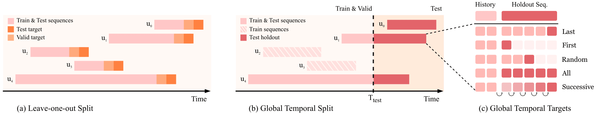

<h1 align="center"> Time to Split: Exploring Data Splitting Strategies for Offline Evaluation of Sequential Recommenders</h1>


<a href="https://arxiv.org/abs/2507.16289"><a>
[](./LICENSE)

[Danil Gusak $^*$](https://scholar.google.com/citations?user=EqAyueEAAAAJ&hl), [Anna Volodkevich $^*$](https://scholar.google.com/citations?user=rYp0bDkAAAAJ&hl), [Anton Klenitskiy $^*$](https://scholar.google.com/citations?user=eGTslO8AAAAJ&hl), [Alexey Vasilev](https://scholar.google.com/citations?user=4vb0JIwAAAAJ&hl), [Evgeny Frolov](https://scholar.google.com/citations?user=l6cMdUEAAAAJ&hl)


> Modern sequential recommender systems have become increasingly prominent in academia and industry due to their strong performance in the next-item prediction task. Yet common evaluation protocols for sequential recommendations remain insufficiently developed: they often fail to reflect the corresponding recommendation task accurately, or are not aligned with real-world scenarios.
> 
> Although the widely used *leave-one-out* split matches next-item prediction, it permits the overlap between training and test periods, which leads to temporal leakage and unrealistically long test horizon, ultimately limiting real-world relevance.
*Global temporal splitting* addresses these issues by evaluating on distinct future periods. However, its applications to sequential recommendations remain loosely defined, particularly in terms of selecting target interactions and constructing a validation subset that provides necessary consistency between validation and test metrics.
> 
> We demonstrate that evaluation outcomes can vary significantly across splitting strategies, influencing model rankings and practical deployment decisions. To improve reproducibility in both academic and industrial settings, we compare different splitting strategies for sequential recommendations across multiple datasets and established baselines.
Our findings show that prevalent splits, such as leave-one-out, may be insufficiently aligned with more realistic evaluation strategies.


<div align="center">
    <a >
        
    </a>
    <p>
        <i>Data splitting and target selection strategies for sequential recommendations. (a) Leave-one-out split. (b) Global temporal split: all interactions after timepoint T_test are placed in the holdout set, targets for these holdout sequences are chosen according to (c). (c) Target items selection options for each holdout sequence (applicable for both test and validation sequences).</i>
    </p>
</div>

## Usage

Note: the experiments were conducted with `python==3.10.16`.

Install requirements:

```bash
pip install -r requirements.txt
```

Specify environment variables:

```bash
# data path. Replace with your path if necessary. 
export SEQ_SPLITS_DATA_PATH=$(pwd)/data

# src path
export PYTHONPATH="./"
```

We use [Hydra](https://github.com/facebookresearch/hydra) framework for conveniently configuring our experiments.

### Data

We worked with eight publicly available datasets: Beauty, Sports, Movielens-1m, Movielens-20m, BeerAdvocate, Diginetica, Zvuk, and YooChoose. 
To manage computational costs while ensuring sufficient data for analysis, we sampled 2,000,000 users from the YooChoose dataset and 20,000 users from Zvuk.
*Raw datasets (before the preprocessing step) are available for direct download:* [Raw Data](https://disk.yandex.com/d/RutWRex_12Kfyg).

Each dataset has a corresponding config, e.g. ```runs/configs/dataset/Beauty.yaml```.

### Data Preprocessing

Create data directories:

```bash
mkdir $SEQ_SPLITS_DATA_PATH
mkdir $SEQ_SPLITS_DATA_PATH/{raw,preprocessed,splitted}
```

Data folder structure:
- The raw data files are expected in `raw` subdirectory. Move the downloaded raw data .csv files here.
- Data after preprocessing will be placed in the `preprocessed` subdirectory.
- Data after splitting will be placed in the `splitted` subdirectory.

To run dataset preprocessing for a specific dataset, use:
```bash
# specific dataset
python runs/preprocess.py +dataset=Beauty
# all datasets
python runs/preprocess.py -m +dataset=Beauty,BeerAdvocate,Diginetica,Movielens-1m,Sports,Zvuk,Movielens-20m,YooChoose
```

See [preprocess.yaml](runs/configs/preprocess.yaml) for possible configuration options. In the paper, we apply p-core filtering with p equal 5 to discard unpopular items and short user sequences.
Furthemore, we eliminate consecutive repeated items in user interaction histories.

### Data Splitting

Split the selected dataset into training, validation, and test subsets.
Data after splitting will be placed in the `splitted` subdirectory.
See [split.yaml](runs/configs/split.yaml) for possible configuration options.

For GTS, validation split options are:
- by_time (Global temporal, GT);
- last_train_item (Last training item, LTI);
- by_user (User-based, UB).

```sh
# example for LOO
python runs/split.py split_type=leave-one-out dataset=Beauty

# example for GTS with Global temporal validation
python runs/split.py split_type=global_timesplit split_params.quantile=0.9 split_params.validation_type=by_time dataset=Sports
# example for GTS with Last training item validation
python runs/split.py split_type=global_timesplit split_params.quantile=0.9 split_params.validation_type=last_train_item dataset=Beauty 
# example for GTS with User-based validation
python runs/split.py split_type=global_timesplit split_params.quantile=0.9 split_params.validation_type=by_user split_params.validation_size=1024 dataset=Beauty
```

To run all splits, execute [split.sh](runs/run_sh/split.sh). Replace `SEQ_SPLITS_DATA_PATH` with your path if necessary. 
```sh
./runs/run_sh/split.sh
```

### Calculate Split Statistics

Calculate different resulting subset statistics for the chosen splitting strategy.
See [statistics.yaml](runs/configs/statistics.yaml) for possible configuration options.


```sh
# example for GTS with LTI validation
python runs/statistics.py split_type=global_timesplit split_params.quantile=0.9 split_params.validation_type=val_last_train_item dataset=Beauty
```

To run all statistics calculation, execute [stats.sh](runs/run_sh/stats.sh). Replace `SEQ_SPLITS_DATA_PATH` with your path if necessary. 
```sh
./runs/run_sh/stats.sh
```

## Training and Evaluation

### Metrics

We use popular *unsampled* top-K ranking metrics: Normalized Discounted Cumulative Gain (NDCG@K), Mean Reciprocal Rank (MRR@K) and HitRate (HR@K), with K = 5, 10, 20, 50, 100. We compute metrics using [RePlay](https://github.com/sb-ai-lab/RePlay) framework.

### Models

We conduct our experiments using three popular sequential recommender systems baselines:

- SASRec (denoted as SASRec $^+$ in the paper);
- BERT4Rec;
- GRU4Rec.

Each model has a config with a corresponding hyperparameter grid, e.g. ```runs/configs/model/BERT4Rec.yaml```. Parameter `grid_point_number` represents the order number in the hyperparameter grid.

### Model Training and Metrics Calculation

Config [train.yaml](runs/configs/train.yaml) 
combines all configurations required for model training and evaluation.

For GTS (`split_type=global_timesplit`), validation split options are:
- val_by_time (Global temporal, GT);
- val_last_train_item (Last training item, LTI);
- val_by_user (User-based, UB).

Run training, and validation/test metrics computation:
```sh
# example for LOO
python runs/train.py split_type=leave-one-out dataset=Beauty

# example for GTS Last with GT validation
python runs/train.py dataset=Sports split_type=global_timesplit split_subtype=val_by_time quantile=0.9 cuda_visible_devices=0
# example for GTS Last with LTI validation
python runs/train.py dataset=Beauty split_type=global_timesplit split_subtype=val_last_train_item quantile=0.9 cuda_visible_devices=1
# example for GTS Last with UB validation
python runs/train.py dataset=Beauty split_type=global_timesplit split_subtype=val_by_user quantile=0.9 cuda_visible_devices=1
```

Run training with subsequent GTS Successive evaluation:
```sh
# example for GTS with User-based validation
python runs/train.py --config-name=train evaluator.successive_test=True split_type=global_timesplit split_subtype=val_by_user dataset=Beauty quantile=0.9
# same example, but run several grid points at once
python runs/train.py --config-name=train -m evaluator.successive_test=True split_type=global_timesplit split_subtype=val_by_user quantile=0.9 dataset=Beauty model.grid_point_number=0,1
```


### Results

All of the experiment results are available in the [results](data/results) directory, organized by split configuration, dataset, quantile, and model. Inside each
```
results/
└─ <split_type>/
   └─ <split_subtype>/
      └─ <dataset>/
         └─ <quantile>/
            └─ <model>/
               └─ final_results/
                  └─...
```
you can find `.csv` files containing all test and validation metrics for different targets and for every hyperparameter setting (108 grid points for SASRec⁺/BERT4Rec, 104 for GRU4Rec). 

#### Notebooks
- [Dataset_statistics_tables.ipynb](notebooks/Dataset_statistics_tables.ipynb) Run after `Calculate Split Statistics` and previous pipeline steps to builds all tables from the paper along with additional statistics,
- [Time_gaps.ipynb](notebooks/Time_gaps.ipynb) Run after `Data Splitting` and previous pipeline steps to build Figure 4,
- [Test_vs_test.ipynb](notebooks/Test_vs_test.ipynb) reproduces Figure 5 and Figure 6 from the paper,
- [Test_vs_validation.ipynb](notebooks/Test_vs_validation.ipynb) reproduces Figure 8.


## 📜 Citation

If you find our work helpful, please consider citing the paper:

```bibtex
@inproceedings{timetosplit2025,
  title={Time to Split: Exploring Data Splitting Strategies for Offline Evaluation of Sequential Recommenders},
  author={Gusak, Danil and Volodkevich, Anna and Klenitskiy, Anton and Vasilev, Alexey and Frolov, Evgeny},
  booktitle={Proceedings of the 19th ACM Conference on Recommender Systems},
  doi = {10.1145/3705328.3748164},
  year={2025}
}
```